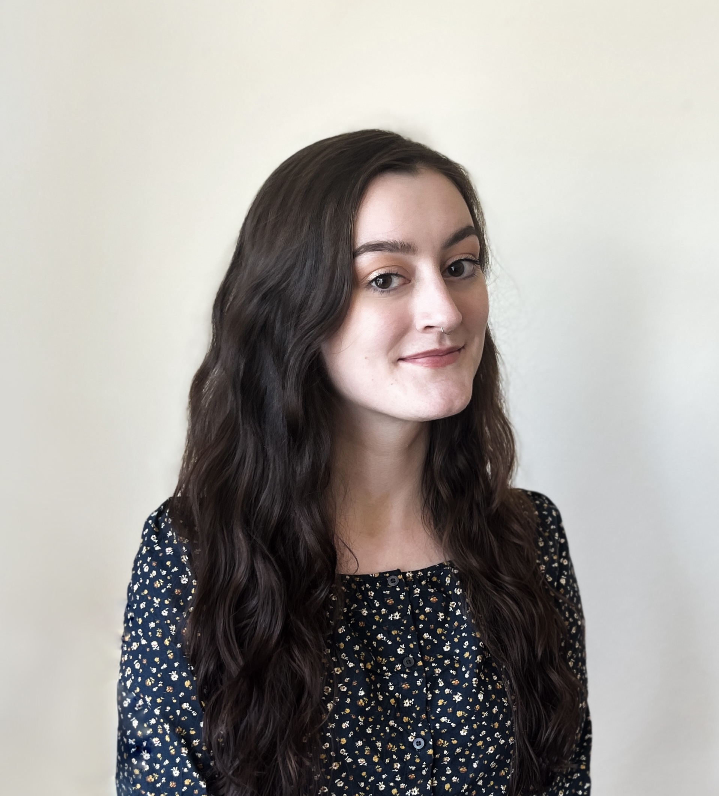

<a href="projects.md">Projects</a>

I am a PhD student in Sociology and Demography and a Computational Social Science Training Program fellow at UC Berkeley. My research broadly focuses on neighborhood change, socioeconomic and historical causes of health inequality, and the effects of gentrification and displacement.

One of my current projects looks at air pollution exposure differentials among internal migrants in the US across racial and socioeconomic groups. Another project focuses on cohort imprinting effects in seasonal influenza mortality.

I a BA in Geography and Data Science from the University of Washington in 2022.
